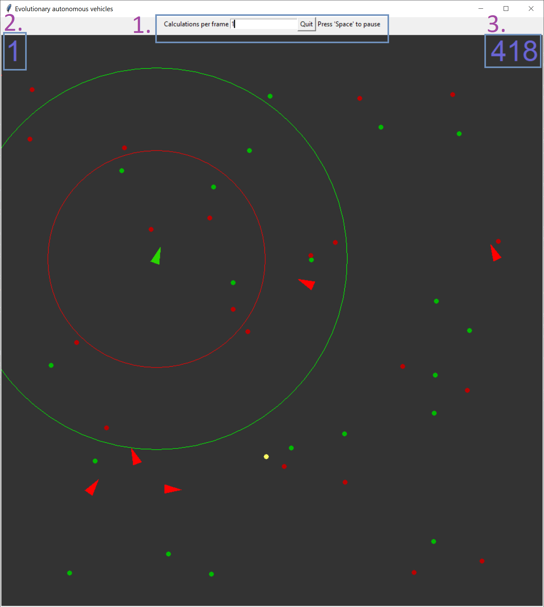

# Evolutionary-Steering-Behaviour
## Brief description
During the simulation Vehicles evolve to stay alive longer and longer. Genetic algorithm is used to transfer best attributes of the longes
living Vehicles to new Entities of a new generation. It may happen that even one Vehicle has quite good attributes it hasn't lived for a
long time. That's the reson why chance is given to the short living Vehicles to tranfer their attributes, because they may live longer in
different conditions. To keep some variety mutation is used with some probability.

## How to run
It was tested with Python 3.7.4 with Tkinter installed (graphic library)  
python main.py

## Constants
It is possible to adjust parameters of the simulation in Constants.py file.  
Most "interesting":  
NUM_OF_FOOD (number of food entities on board, default = 20)  
NUM_OF_POISON (number of poison on board, default = 20)  
NUM_OF_VEHICLES (number of vehicles on board, default = 10)  
MUTATATION_RATE (the probability of mutation to happen, default = 0.1)  
MUTATION_IMPACT (how the mutation can impact attributes, default = 0.05)  

## Interface
 <\br>
1. From the left:
 * space where you can put number of calculations per frame (default = 1, it does not need to be confirmed),
 * 'Quit' - press to end the whole program,
 * You can always press space to pause the program,
2. Number of Vehicles alive,
3. Number of iterations the best vehicle stayed alive.
